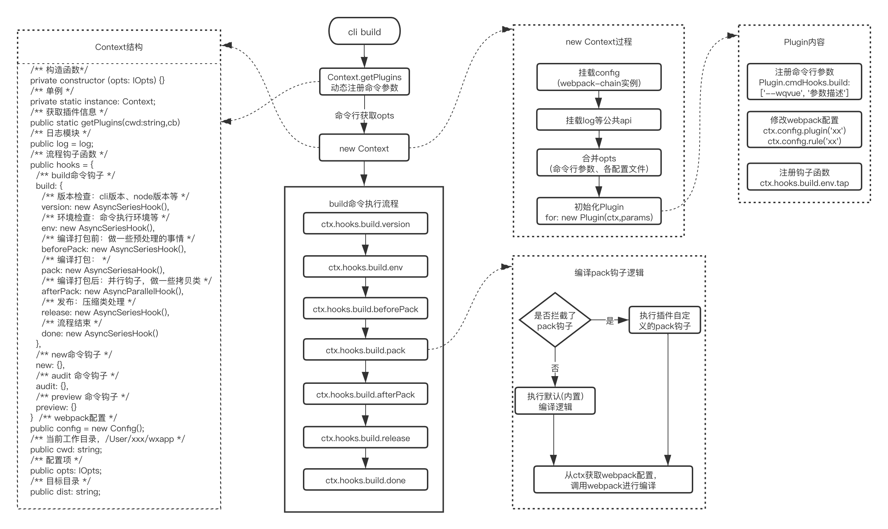

## 插件开发指南
如果现有 CLI 功能不满足你的需求，dm-cli 提供一套完整的 插件机制，通过它可以：修改命令执行流程、修改内置webpack配置、动态注册命令行参数，从而完成你的个性化需求。
### 插件设计


设计解读：
1. dm-cli 提供了一套 CLI 子命令，包括：build、init、audit、preview 等。后续会提供其他子命令。
2. 每一个子命令有一套标准的执行流程，如 build 命令流程：版本检查 → 环境检查 → 编译前预处理 → 编译打包 → 编译后处理 → 发布 → 结束。
3. 每一个子命令执行流程对应一套基于 [Tapable](https://github.com/webpack/tapable) 的`事件钩子`，如 build：version、env、beforePack、pack、afterPack、release、done。`命令的执行过程，就是依次执行这些事件钩子上注册的函数`。插件可以通过`监听事件钩子`来完成个性化动作。
4. build 命令流程的核心事件钩子 pack 借助 webpack 来完成。 插件可以借助现有生态修改 webpack 配置快速完成个性化处理。
5. 插件可以动态注册命令行参数，结合插件本身的特性完成对命令行的扩展。
6. 全局唯一的 Context，如图，实例 ctx 挂载了 log、webpack-chain、hooks 等公共 api，整合了配置文件参数、命令行参数。插件初始化时会传入 ctx 供插件使用。

### 插件引入
在配置文件 dm.config.js 中申明 plugins 字段，示例如下：其中字符串既可以是 npm 包名，也可以是文件绝对路径，参数可选。
```js
module.exports = {
  /** type: (string|[string]|[string, object])[] */
  plugins:[require.resolve('dm-plugin-xx'),['/path/to/plugin',{param:'xx'}]]
}
```

### 插件开发
一个简单的示例如下，这个插件将为 dm build 命令添加 --my 参数、版本检查阶段多输出一段日志、完全移除检查 npm 的步骤、编译新增 scss 文件支持。
```js
export default class dmPluginMy {
  /** 注册子命令参数 */
  static cmdHooks = {
    build: [
      ['-m, --my <value>', '给build命令添加 --my 参数，简写 -m，参数值必填']
    ]
  }
  ctx: IContext;
  params?: ILooseObject;
  constructor (ctx: IContext, params?: ILooseObject) {
    this.ctx = ctx;
    this.params = params || {};
    this.initHooks();
    this.configWebpack();
  }
  initHooks (): void{
    const buildHooks = this.ctx.hooks.build; // build命令的hooks
    /** 监听 build命令的 version 事件钩子，添加逻辑 */
    buildHooks.version.tapPromise('DmPluginMy-checkVersion', async () => {
      this.ctx.log.debug('添加检查逻辑，命令行传递的my参数值：', this.ctx.opts.my)
      // await checkVersion(this.ctx);
    })
    /**  拦截器 可直接移除其他插件监听的事件钩子 */
    buildHooks.env.intercept({
      register: (tapInfo) => {
        if (tapInfo.name === 'DmPluginMy-checkNpm') {
          tapInfo.fn = async (): Promise<void> => Promise.resolve();
        }
        return tapInfo;
      }
    })
  }
  /** 修改编译打包的webpack配置，使其支持scss处理 */
  configWebpack (): void {
    const ctx = this.ctx;
    const config = ctx.config
    config.module
      .rule('scss').test(/\.scss$/)
      .use('postcss-loader').loader('postcss-loader').end()
  }
}
```
几点注意事项
1. 代表插件的文件应该默认导出(export default MyClass 或者 module.exports = MyClass)一个 class
2. 注册子命令需要使用静态属性。
3. 构造函数第一个参数是 Context 实例，第二个参数 params 是 plugins 配置中对应的参数。
4. 监听事件钩子时第一个参数（订阅者名称）建议格式：类名-方法名，第二个参数（回调函数）统一使用 async 函数。
5. 插件文档必须写清楚：监听了哪些事件钩子、注册了什么命令行参数、添加/修改了哪些 webpack 配置，以便与其他插件更好的协作。